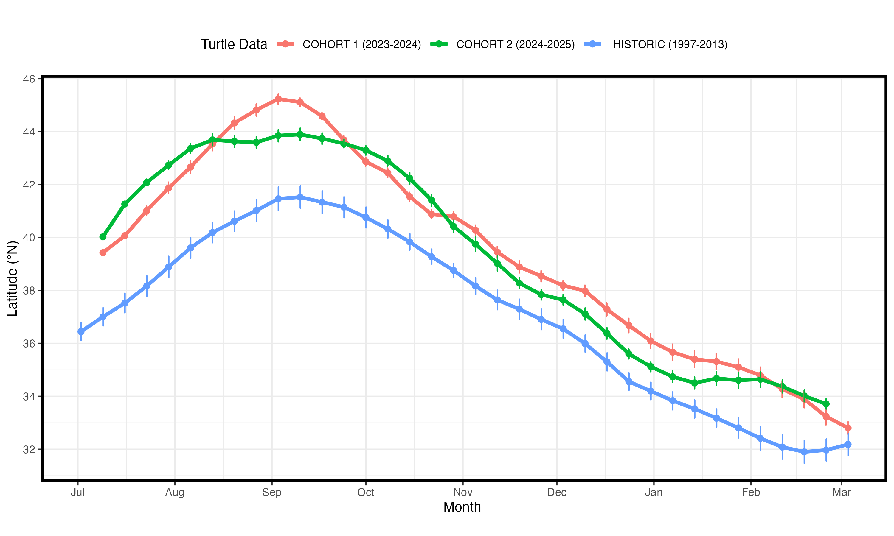
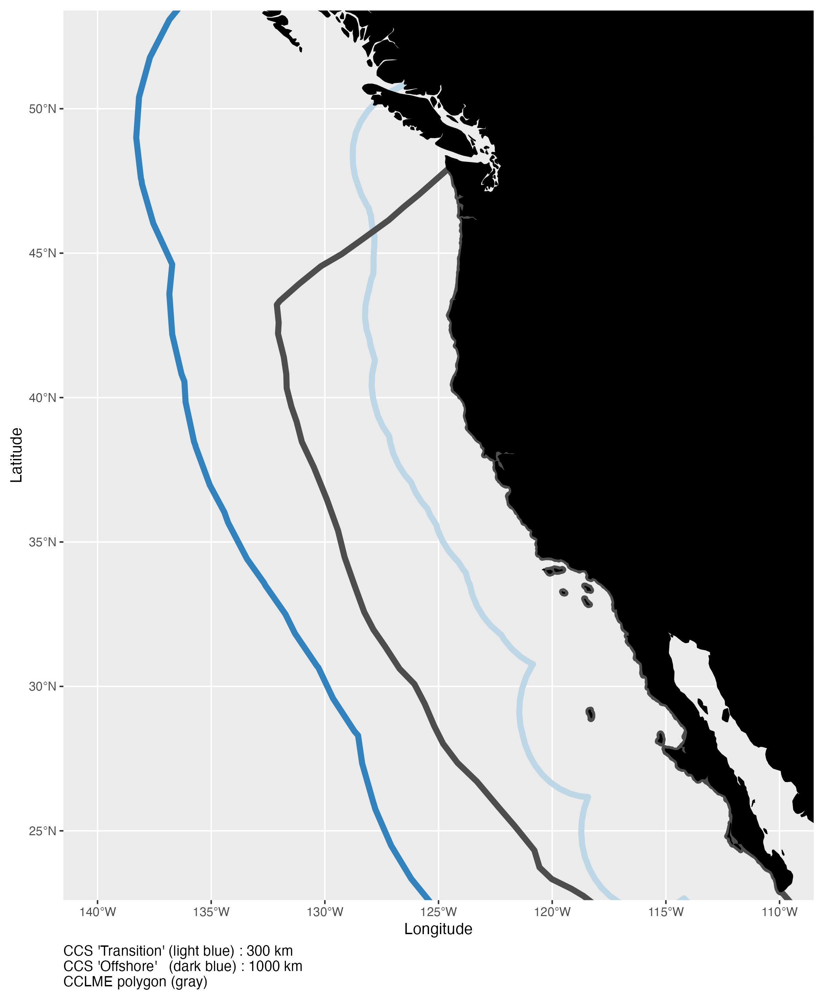
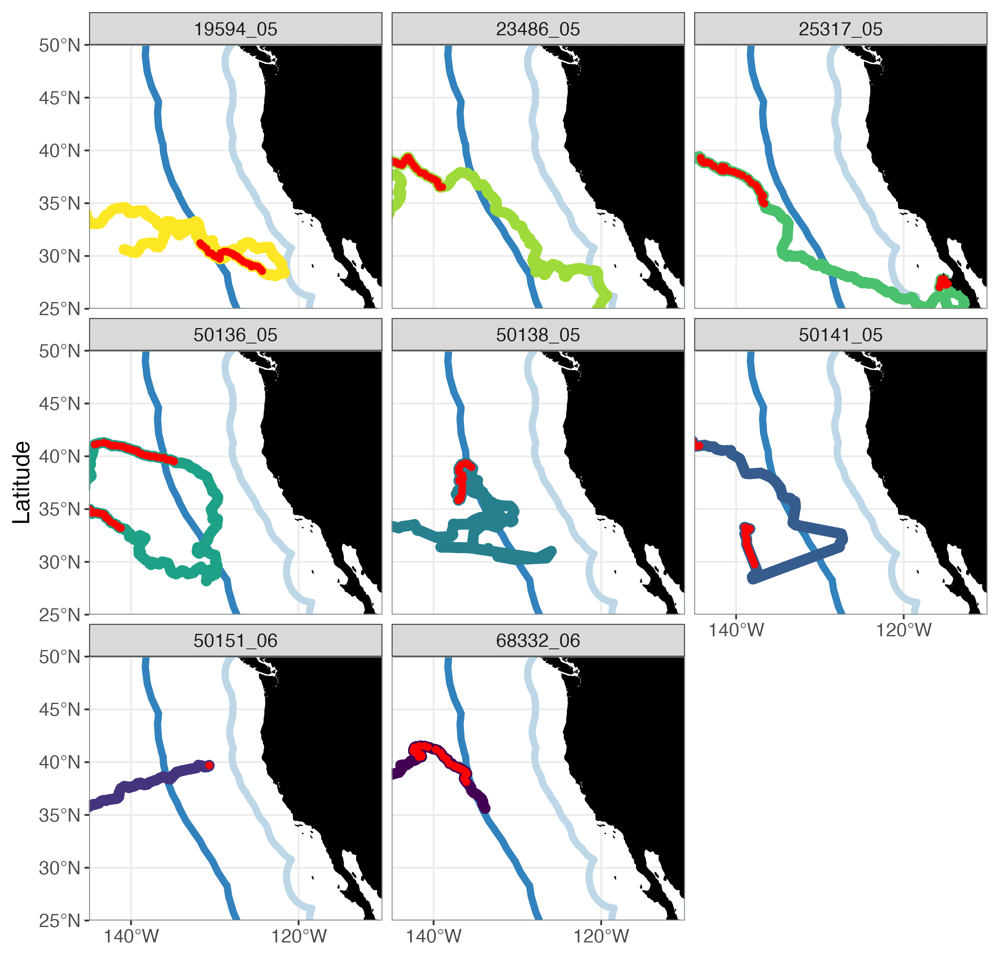
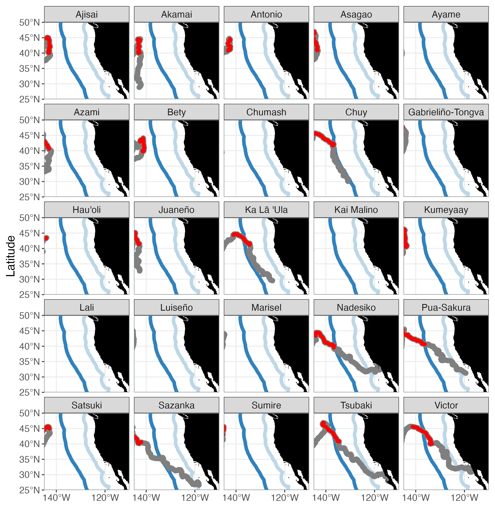
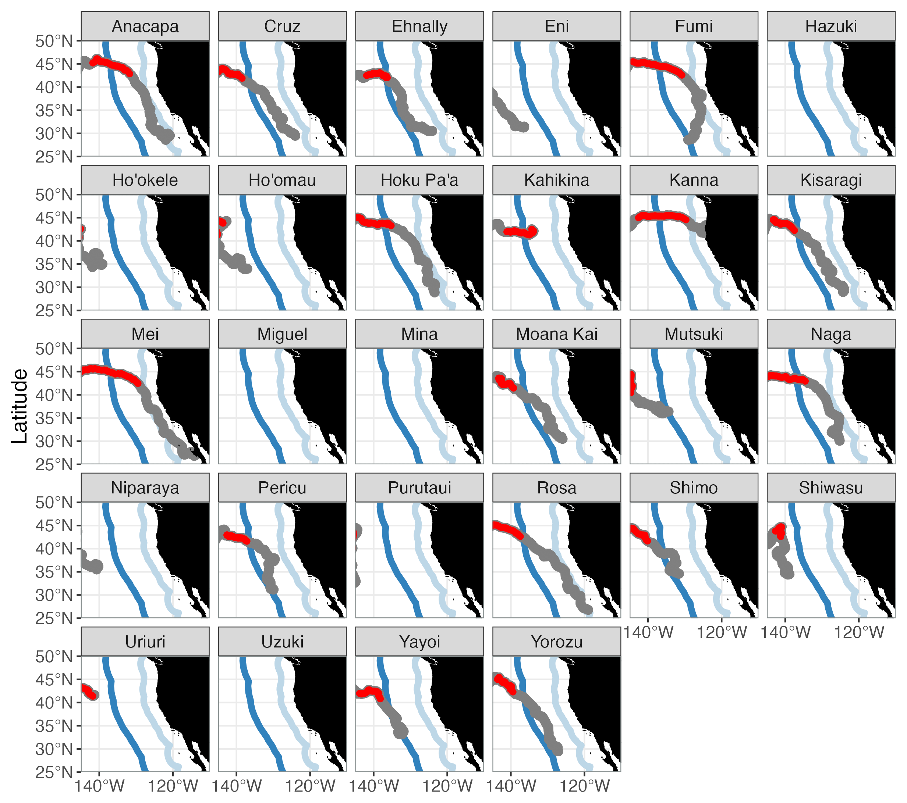
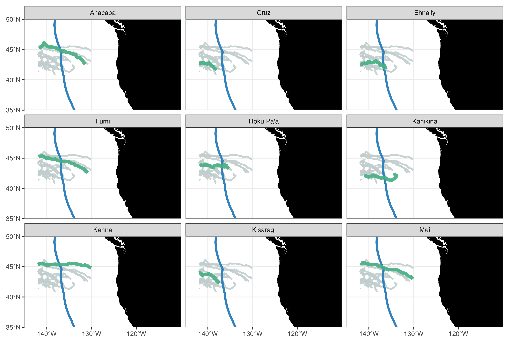
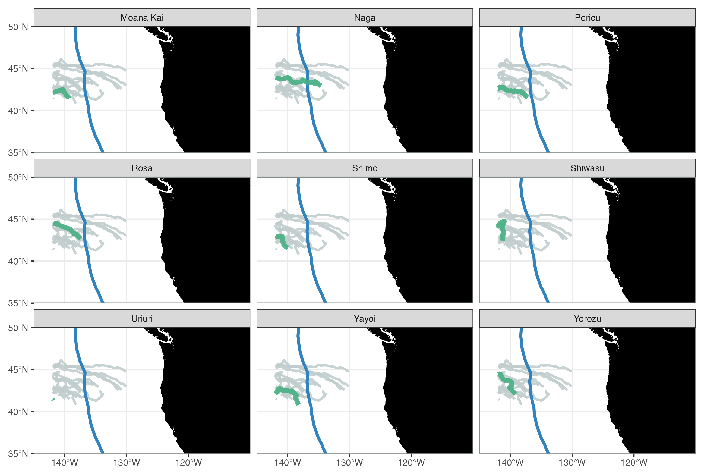

### Average Lats by Date

    

 

### CCS vs CCLME extent

Spatial comparison of the California Current System (CCS) as defined by [Kahru et al. 2018](https://sci-hub.se/10.1016/j.dsr.2018.04.007) vs California Current Large Marine Ecosystem (CCLME) boundary ([see ref](https://www.researchgate.net/publication/229042854_Developing_the_California_Current_Integrated_Ecosystem_Assessment_Module_I_Select_Time-Series_of_Ecosystem_State)). 

A coarse resolution buffer was applied from the North American Coast to delineate the CCS Transition (300 km) and Offshore (1000 km) boundaries. 

 

### Turtle-CCS Movements

Maps showing individual movement into the CCS region by group: Historic, Cohort 1, and Cohort 2  

The portion of the track during [**Sept-Oct**]{style="color:red"} is shown in [**red**]{style="color:red"}  

::: {.panel-tabset}

### Historic

### Cohort 1 (2023)

### Cohort 2 (2024)

:::

 

### Turtle Tracks in ENP by Group
A. All tracks (Historic + STRETCH), B. Historic (2006-2008), C. STRETCH Cohort 1 (2023), D. STRETCH Cohort 2 (2024)

 

### Cohort 2 Tracks in ENP by Individual
Individual plots for each turtle in Cohort 2 that moved east of the release location (n = 18) during Sept-Oct 2024. \

Individual movements for a given turtle are shown in green. All other tracks shown in gray.

 

  

  