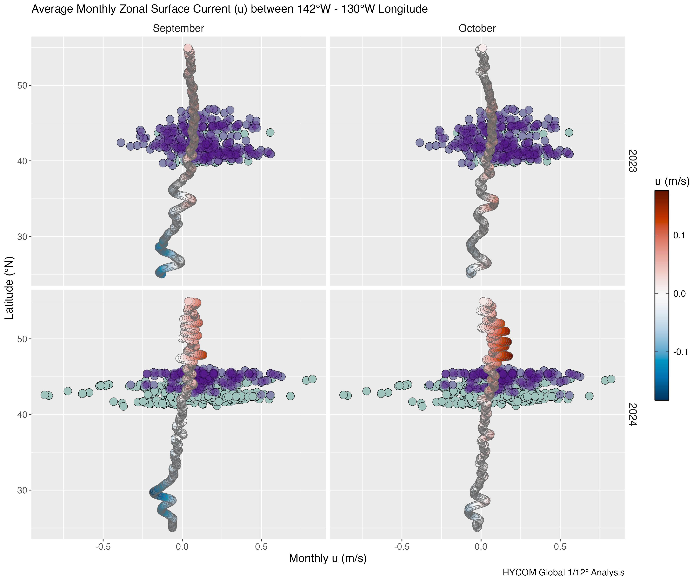
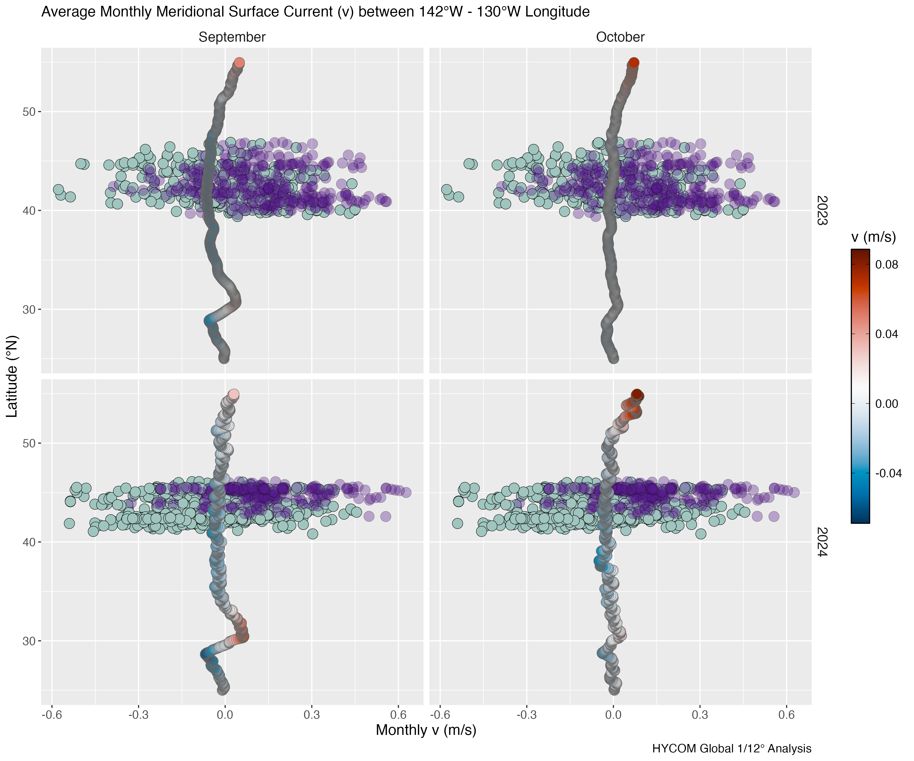
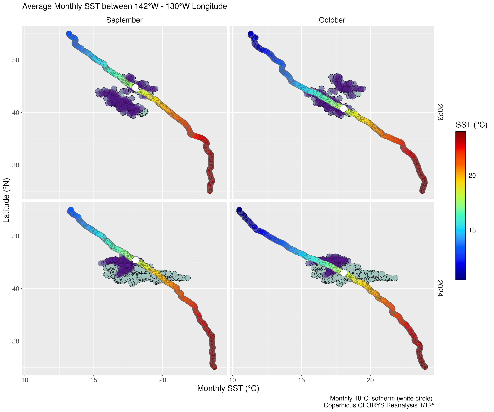

## Turtle-HYCOM Hovm 

Monthly mean Hycom (u, v) and turtle latitudes between 142°W to 130°W longitude.

[Purple circles: individuals that eventually moved into the CCS]{style="color:#231942"}  
[Green circles: all other individual turtle locations]{style="color: #22577a"}  

[*Click images to zoom in*]{style="font-size: 80%;"}  

::: {.panel-tabset}

### Zonal (u)
{group="cc-hycom-hovm"}

### Meridional (v)

{group="cc-hycom-hovm"}

:::

## Turtle-SST Hovm 

Monthly mean SST and turtle latitudes between 142°W to 130°W longitude.

[Purple circles: individuals that eventually moved into the CCS]{style="color:#231942"}  
[Green circles: all other individual turtle locations]{style="color: #22577a"}  
White circle: Average latitude of the 18°C SST isotherm

[*Click images to zoom in*]{style="font-size: 80%;"}  

{group="cc-sst-hovm"}