<!-- ### Turtle - HYCOM Extractions -->

<!--   -->

### Cohort Histograms: u, v

Comparison of surface current values extracted underneath of daily turtle positions: Sept-Oct (2023, 2024)
 

::: {.panel-tabset}

### Zonal (u)
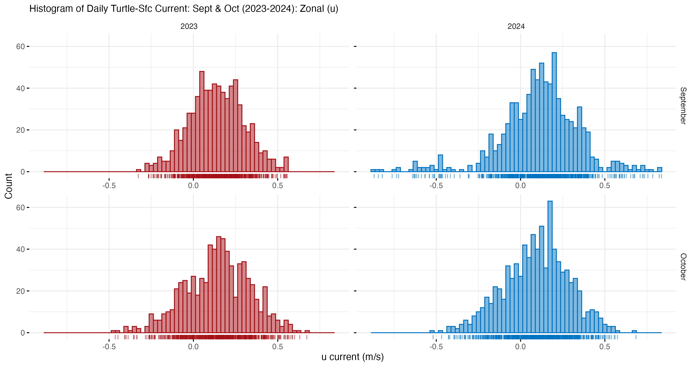{group="cc-hists"}

### Meridional (v)
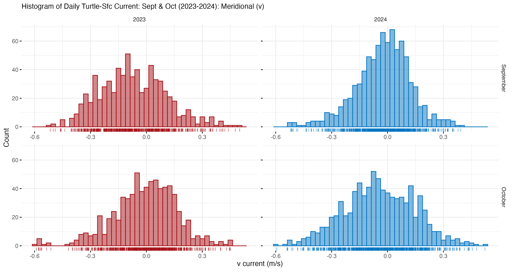{group="cc-hists"}

:::

 

### Individual Histograms: u, v

Distribution of surface current values extracted underneath of Kanna, Mei, Fumi, & Anacapa vs rest of Cohort 2: Sept-Oct (2024)
 

::: {.panel-tabset}

### Zonal (u)
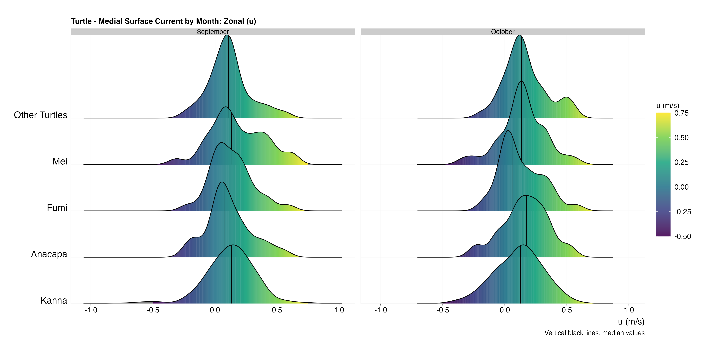{group="cc-ggridges"}

### Meridional (v)
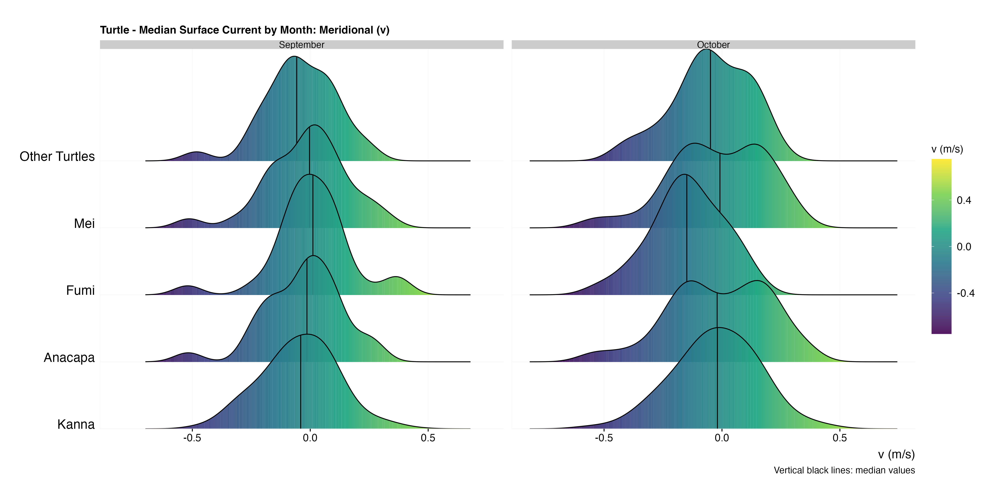{group="cc-ggridges"}

:::

 

### Individual Tracks: u, v

Surface current values extracted underneath of Kanna, Mei, Fumi, & Anacapa positions: Sept-Oct (2024)
 

::: {.panel-tabset}

### Zonal (u)

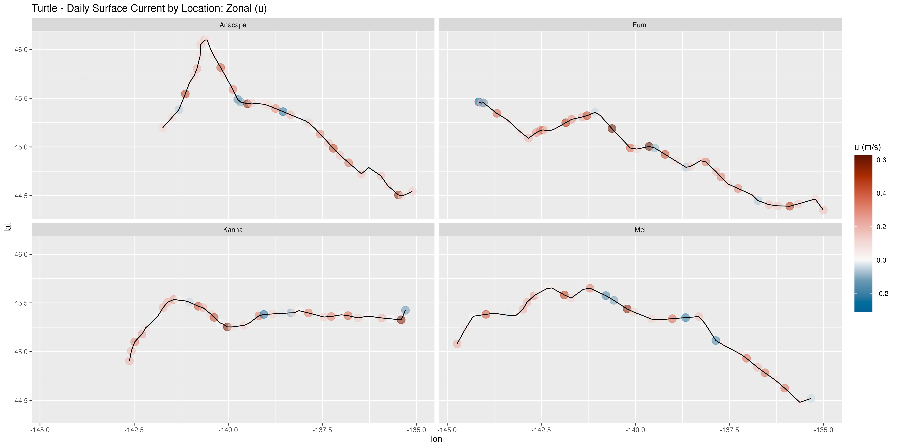{group="cc-hycom"}

### Meridional (v)

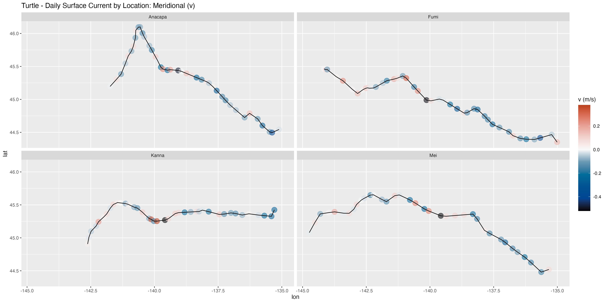{group="cc-hycom"}

:::

 

### Turtle-Hycom Tracks (Sept-Oct)

Cohort 1 & 2 turtle movements with Hycom monthly means (u, v) for Sept-Oct (2023, 2024)  

::: {.panel-tabset}

### Zonal (u) - Sept

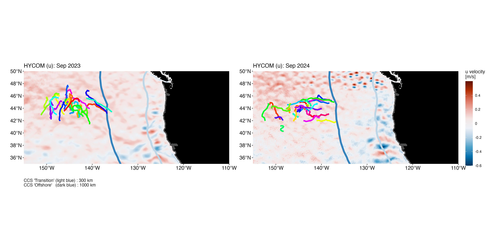{group="cc-hycom"} 

### Oct

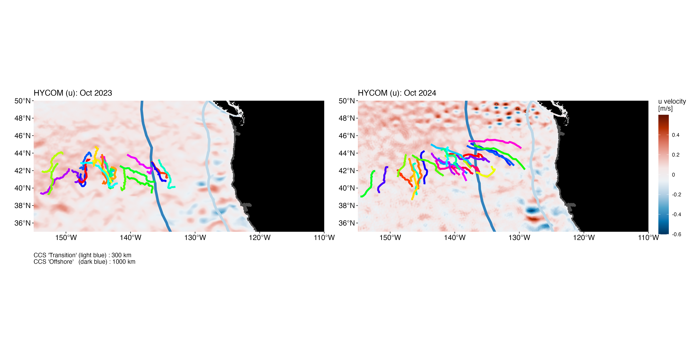{group="cc-hycom"} 

 

:::

 

::: {.panel-tabset}

### Meridional (v) - Sept

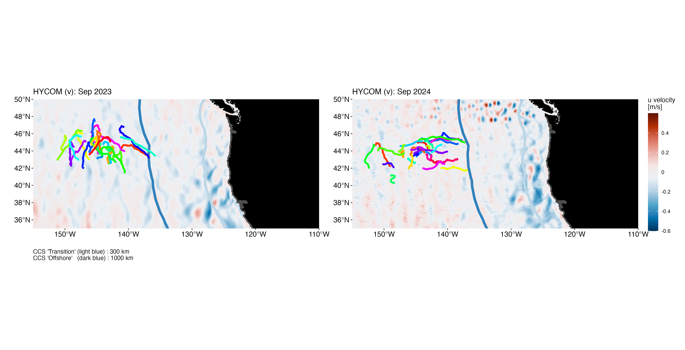{group="cc-hycom"}

### Oct

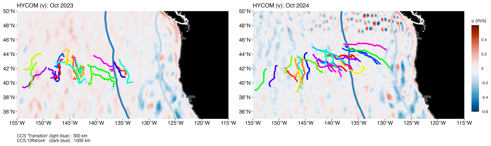{group="cc-hycom"} 

:::

 

### Historic tracks in ENP with Zonal Average \

Individual turtle tracks from the historic data set (n = 2005 - 2008) that moved into the ENP. \
Their annual Sept-Oct positions are shown in black. 

 

The 2014-2024 Sept-Oct climatology of zonal (u) flow is shown as the base layer. (Source: Copernicus GlobalTotal, processed to a 0.25 spatial grid).

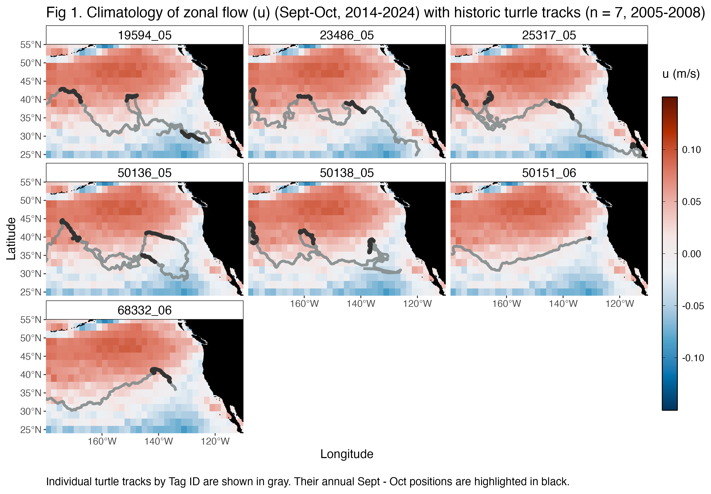