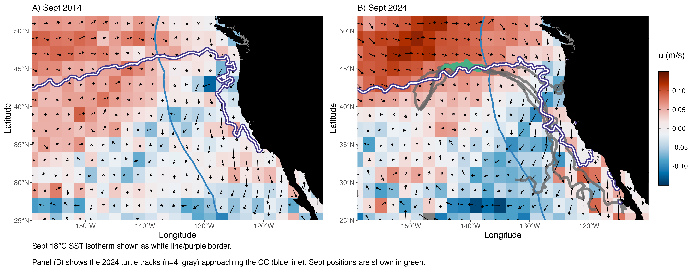
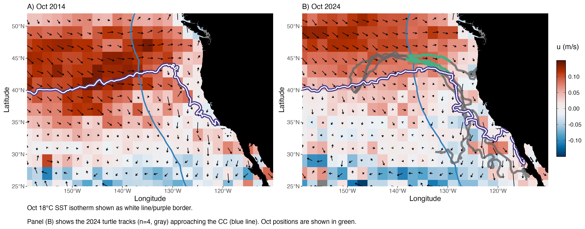

## Draft Manuscript Figures (in progress)

### Fig 1. Sept/Oct currents and historic turtle tracks (2006 - 2007)

Average zonal flow (u) is shown with current vectors for September 2006 & 2007.

Full loggerhead tracks (2005-2008) are shown in gray. September positions between 2006-2007 are shown in green.
See [here](cc_hycom_currents.qmd#historic-tracks-in-enp-with-zonal-average-sept-only) for a detailed figure of individual tracks.

The average position of the 18°C SST isotherm (September 2006-2007) is shown in white/purple border.
The offshore extent of the CC (as defined in Kahru & Jacox, 2018) is shown in blue.

Product: Copernicus Global Total Ocean Currents (Monthly, 0.25°), processed to a 2° x 2° spatial grid.

 

### (A) September & (B) October: 2006 & 2007

 

 

### Fig 2. Mean Turtle Latitude by Year Group 

*Figure from: Briscoe et al. (2025)*

 

### Fig 3. Comparison of Sept/Oct 2014 & 2024 currents & isotherm

Average zonal flow (u) is shown with current vectors for: 

- **September (2014 and 2024)**  

- **October (2014 and 2024)**

Full loggerhead tracks of 4 individuals from Cohort 2 (2024) are shown in gray (Fig 4B). \
Sept/Oct positions (2024) are shown in green.

For both figures, the average position of the Sept/Oct 18°C SST isotherm is shown in white/purple border. \
The offshore extent of the CC (as defined in Kahru & Jacox, 2018) is shown in blue.

Product: Copernicus Global Total Ocean Currents (Monthly, 0.25°), processed to a 2° x 2° spatial grid.

### September 

{group="fig4-currents"}

 

### October 

{group="fig4-currents"}

 

### Fig 4. Four Cohort 2 Turtles in CC & Chl-a (Sept/Oct 2024)

 

### *Possible Fig or Table:* Current Corrected Turtle Speeds
*To be added using Copernicus GlobalTotal product instead of HYCOM*

 