## Draft Manuscript Figures (in progress)

### Fig 1. Map of North Pacific loggerhead tracks

[**Placeholder Figure Below**]{style="color:#7F0000"}

Figure to include historic tracks only (1997-2013) & schematic of North Pacific Current

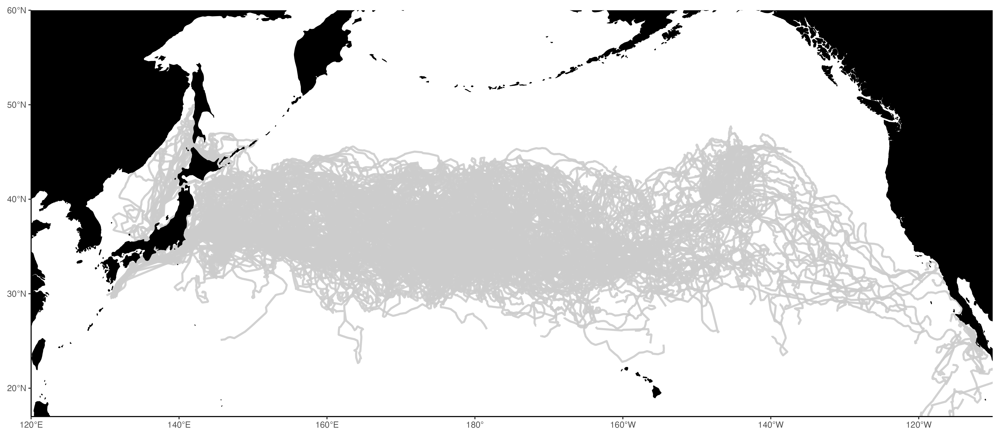

 
 

### Fig 2. Sept/Oct currents and historic turtle tracks (2006 - 2007)

Average zonal flow (u) is shown with current vectors for (a) September and (b) October 2006 & 2007.

Full loggerhead tracks (2005-2008) are shown in gray. September and October positions between 2006-2007 are shown in green.
The average position of the 18°C SST isotherm (September/October 2006-2007) is shown in white/purple border.

Product: Copernicus Global Total Ocean Currents (Monthly, 0.25°), processed to a 2° x 2° spatial grid.

[**To Do: Remove CC boundary (blue) and revisit color scheme**]{style="color:#7F0000"}

 
 

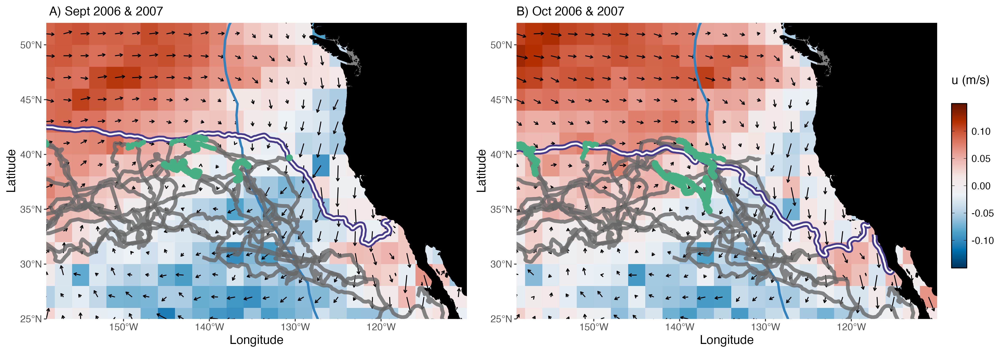

 
 

### Fig 3. Sept/Oct currents and STRETCH turtle tracks (2024)

Average zonal flow (u) is shown with current vectors for: (a) September and (b) October 2024.

Full loggerhead tracks of 4 individuals from Cohort 2 (2024) are shown in gray (Fig 4B).
Sept/Oct positions (2024) are shown in green.
For both figures, the average position of the Sept/Oct 18°C SST isotherm is shown in white/purple border. \

Product: Copernicus Global Total Ocean Currents (Monthly, 0.25°), processed to a 2° x 2° spatial grid.

[**To Do: Combine figs, remove CC boundary (blue) and revisit color scheme**]{style="color:#7F0000"}

 

::: {layout-ncol=2}
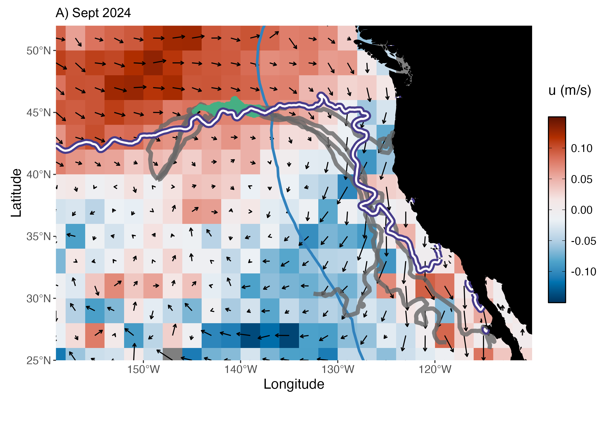{group="fig4-currents"}

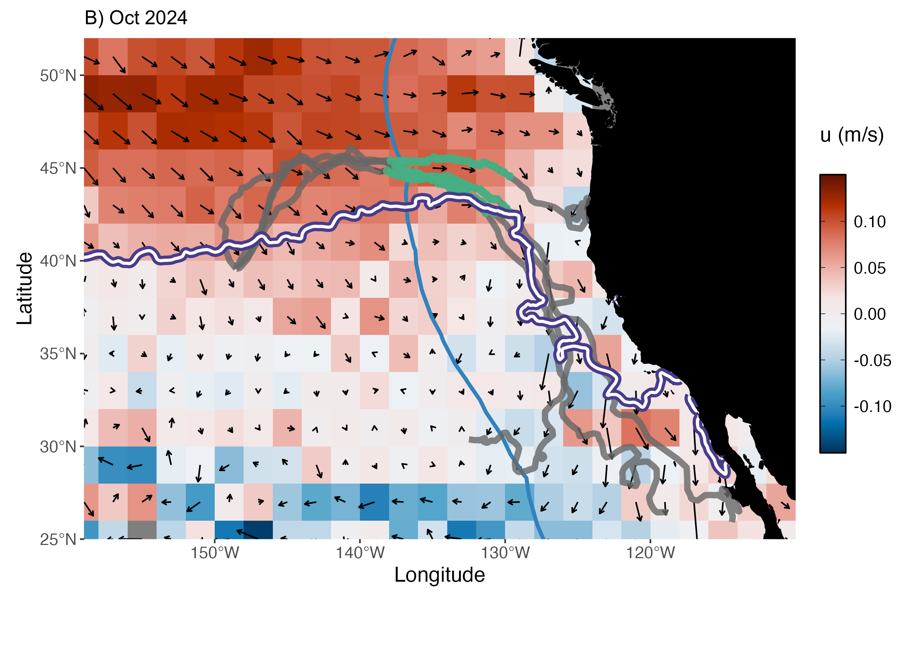{group="fig4-currents"}
:::

 
 

### Fig 4. Mean Turtle Latitude by Year Group 

*Figure from: Briscoe et al. (2025)* -- [**Possibly omit and just reference in text - TBD**]{style="color:#7F0000"}

 
 

### Fig 5. STRETCH turtle swimming vs current speeds (4 indivs 2024)

*Click on figures to zoom in* \

::: {layout-ncol=2}
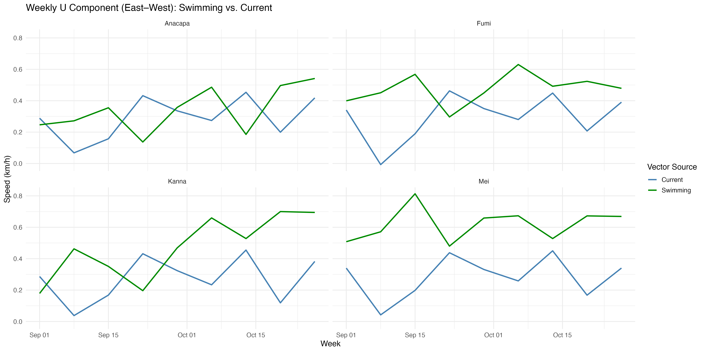{group="fig5-speeds"}

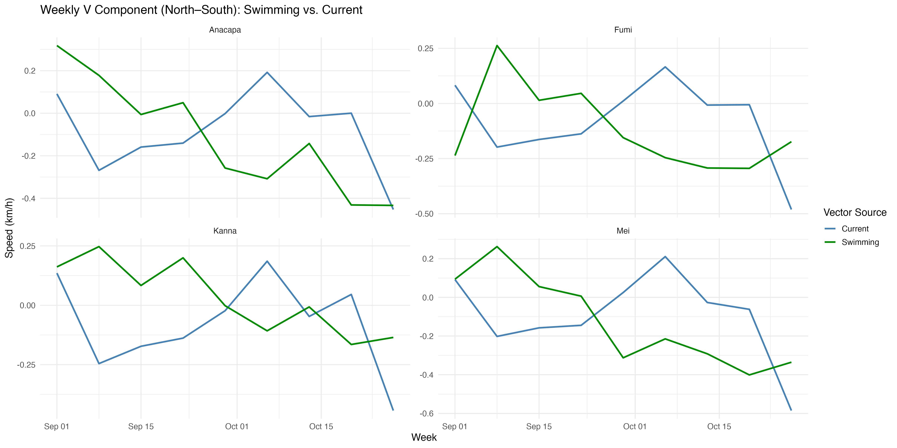{group="fig5-speeds"}

:::

 
 

### Fig 6. Daily Turtle-SST extractions (n=4, 2024 Cohort) 

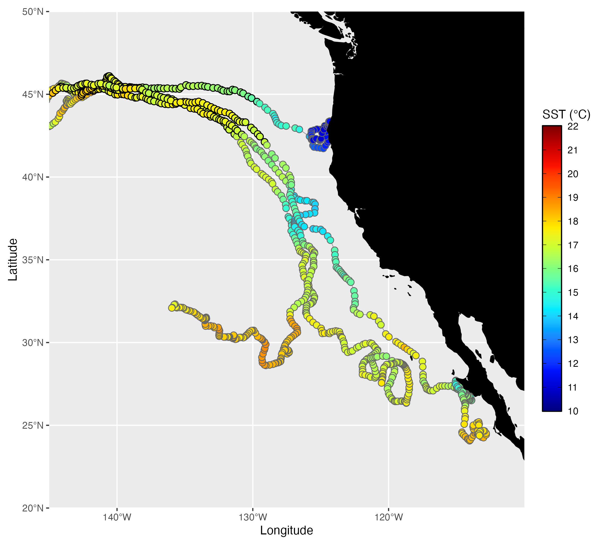

 
 

### Fig 7. Chl-a and STRETCH turtle tracks (Sept-Dec, 2024) 

 
4 turtles shown in solid gray/black. Rest of Cohort 2 shown in light gray.

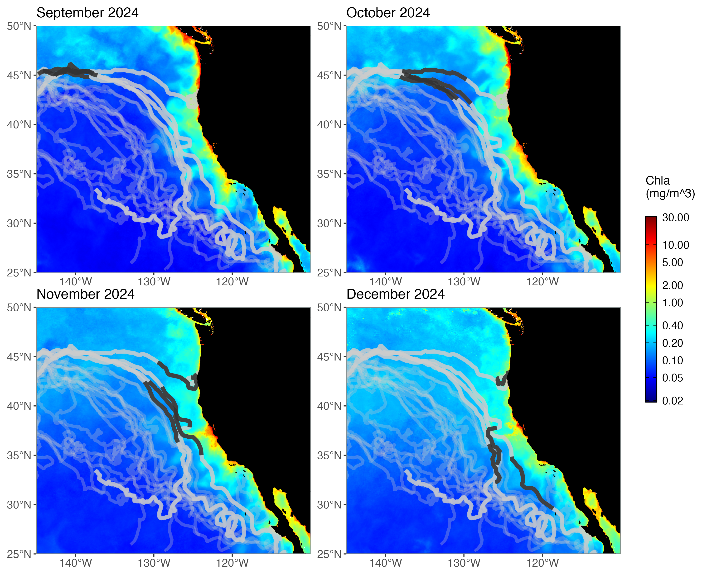

 
 

### Fig 8. Sept/Oct currents (2014)

Average zonal flow (u) is shown with current vectors for: (a) September and (b) October 2014.

For both figures, the average position of the Sept/Oct 18°C SST isotherm is shown in white/purple border. \

Product: Copernicus Global Total Ocean Currents (Monthly, 0.25°), processed to a 2° x 2° spatial grid.

[**To Do: Combine figs, remove CC boundary (blue) and revisit color scheme**]{style="color:#7F0000"}

 

::: {layout-ncol=2}
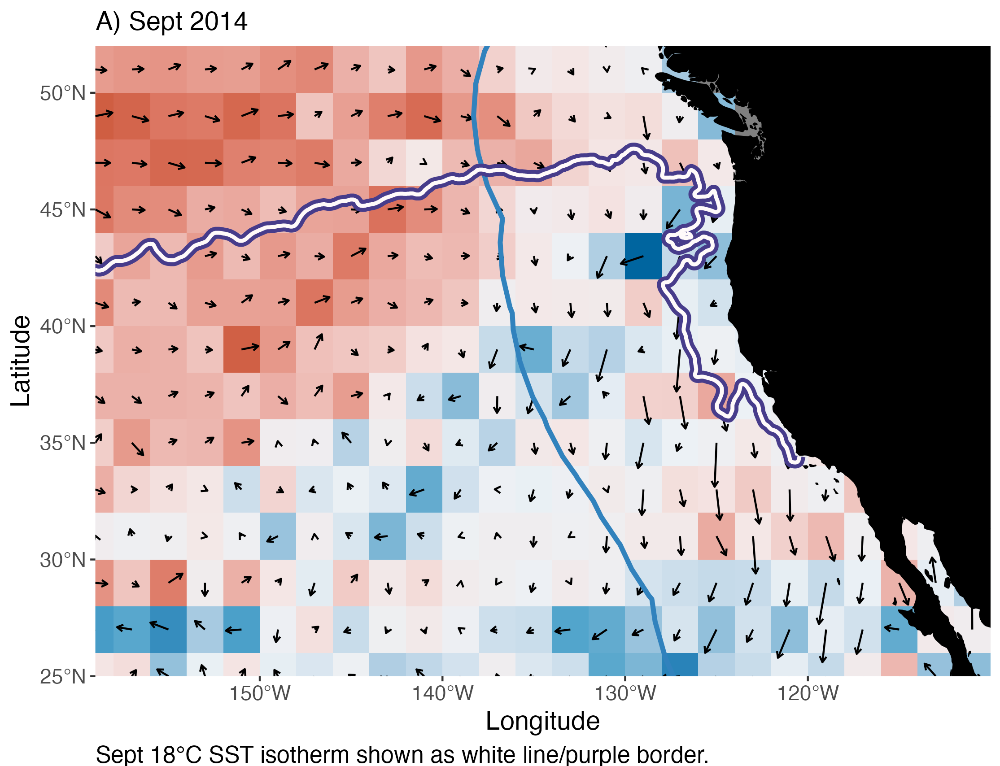{group="fig4-currents"}

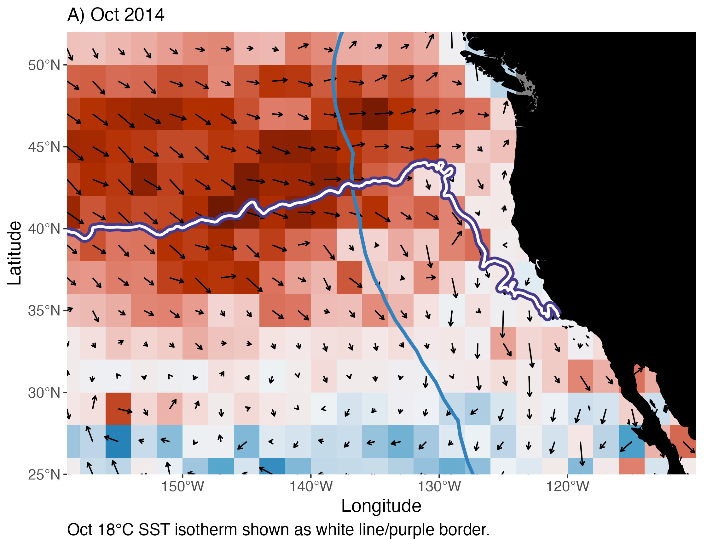{group="fig4-currents"}
:::

 
 

## Supplemental Figures (in progress)

### SFig 1. Sept/Oct currents (2004-2024)

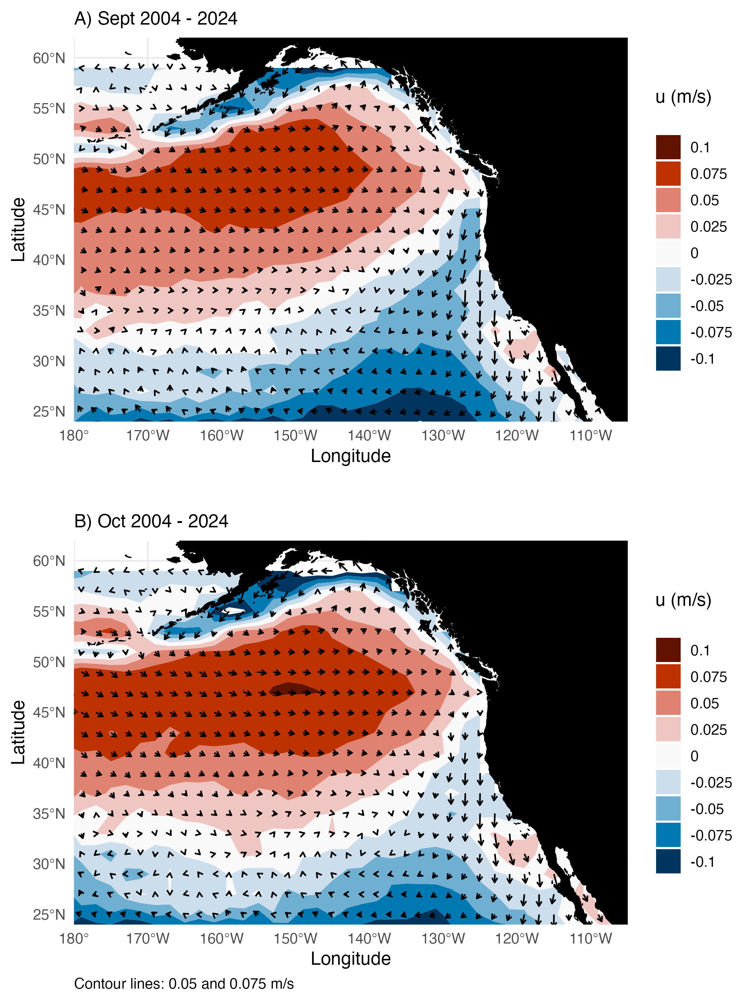    
 
 