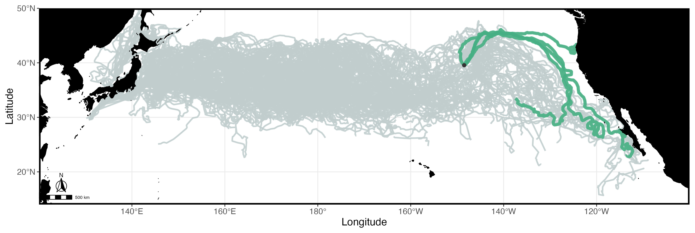
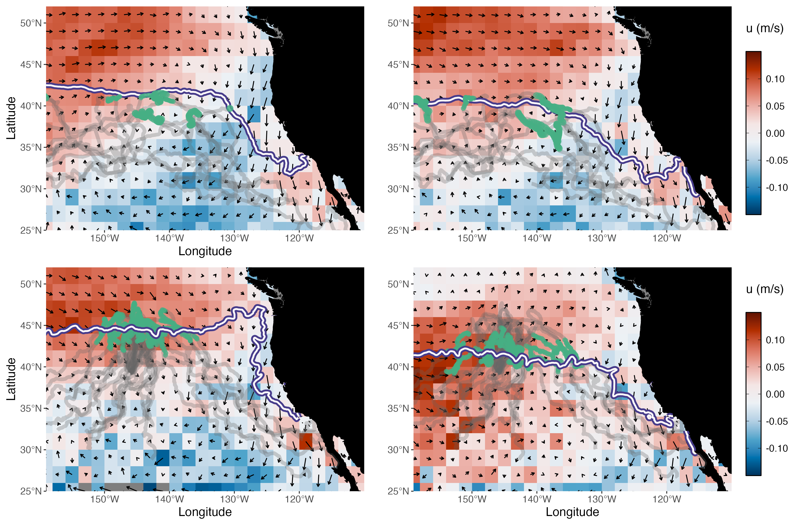
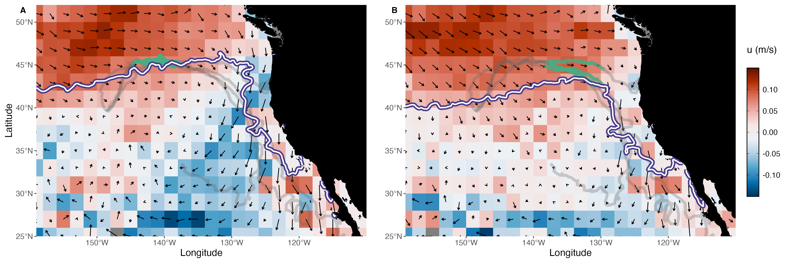
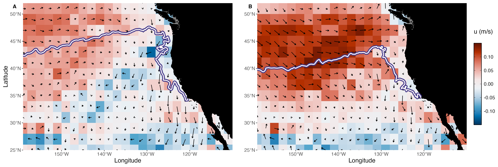

## Draft Manuscript Figures (in progress)

### Fig 1. Map of North Pacific loggerhead tracks

\

[*Placeholder Figure Below. To do: add schematic of North Pacific Current*]{style="color:#7F0000"}
Release location for Cohort 2 (July 7th, 2024) shown as black circle.

 

{ height=300px }

 
 

### Fig 2. Sept/Oct 2006-2007 and 2023 currents and turtle tracks

Average zonal flow (u) is shown with current vectors for (A) September 2006-2007 and (B) October 2006-2007, (C) September 2023, and (D) October 2023. 

Full loggerhead tracks (A-B: 2005-2008; C-D: 2023) are shown in gray. Their September and October positions are shown in green.
The average monthly position of the 18°C SST isotherm is shown in white/purple border.

Product: Copernicus Global Total Ocean Currents (Monthly, 0.25°), processed to a 2° x 2° spatial grid.

 
 

### Fig 3. Sept/Oct 2024 currents and turtle tracks 

Average zonal flow (u) is shown with current vectors for: (A) September 2024 and (B) October 2024.

 
 

### Fig 4. Mean Turtle Latitude by Year Group 

*Figure from: Briscoe et al. (2025)* 
<!-- -- [**Possibly omit and just reference in text - TBD**]{style="color:#7F0000"} -->

{ width=70% }

 
 

### Fig 5. STRETCH turtle movement vs current speeds (4 indivs 2024)

*Click on figures to zoom in*. [**To do: change 'swimming' to 'movement'**]{style="color:#7F0000"} 

\

::: {layout-ncol=2}

{group="fig5-speeds"}

{group="fig5-speeds"}
:::

 
 

### Fig 6. Daily Turtle-SST extractions (n=4, 2024 Cohort) 

{ height=600px }

 
 

### Fig 7. Chl-a and STRETCH turtle tracks (Sept-Dec, 2024) 

 
4 turtles shown in solid gray/black. Rest of Cohort 2 shown in light gray.

 
 

### Fig 8. Sept/Oct 2014 currents

Average zonal flow (u) is shown with current vectors for: (a) September and (b) October 2014.

  

 
 

## Supplemental Figures (in progress)

### SFig 1. Sept/Oct currents (2004-2024)

{ height=600px }    
 
 