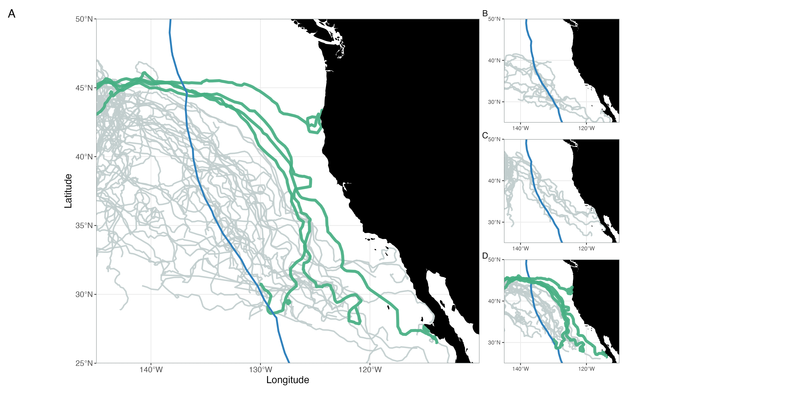

### Draft MS Figures

### ENP Current Climatology

 

### Turtle Tracks in ENP by Group
A. All tracks (Historic + STRETCH), B. Historic (2006-2008), C. STRETCH Cohort 1 (2023), D. STRETCH Cohort 2 (2024)

 

### Weekly Turtle-Current Averages
*To be added*

 

### 4 Cohort 2 Turtles in CC & Chl-a (Sept/Oct 2024)

 

### Current Corrected Turtle Speeds
*To be added*

 