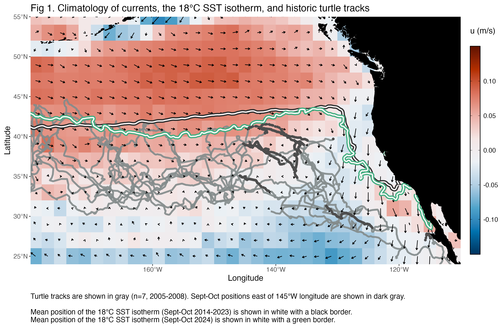
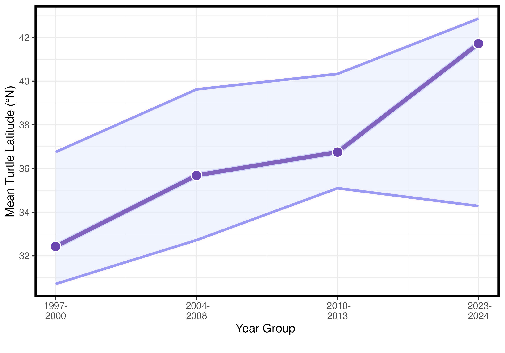
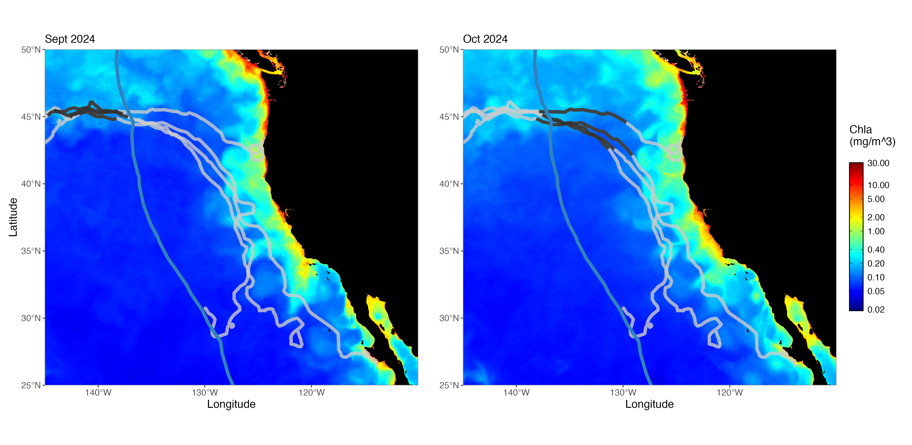

### Fig 1. ENP Current Climatology

*see* here for other spatial resolution examples

 

 

### Fig 2. Mean Turtle Latitude by Year Group 

*Figure from: Briscoe et al. (2025)*

 

### Fig 3. Four Cohort 2 Turtles in CC & Chl-a (Sept/Oct 2024)

 

### Fig 4. Comparison of Sept 2014 & 2024 currents & isotherm
*Compare warming events and show possible corridor/presence of turtles within CC*

 

### *Possible Fig or Table:* Current Corrected Turtle Speeds
*To be added using Copernicus GlobalTotal product instead of HYCOM*

 