## Draft Manuscript Figures (in progress)

### Fig 1
Study area of juvenile North Pacific loggerhead sea turtles (n = `r 82 + 53`) spanning 15°N–50°N latitude and 160°W–105°W longitude between 1997 and 2025. Historical tracks are shown in grey. Twenty-eight turtles were released in July 2024 (dark grey lines; release site indicated by a white circle), of which four individuals (colored lines) traversed the northern California Current System (CCS).

*Figure is a work in progress. Long-term average zonal (u, m/s) current (Sept-Oct, 2004-2024) shown underneath tracks and across the North Pacific (inset map). Within the study region, the core North Pacific Current flow is shown in dark red.*
\

<!-- 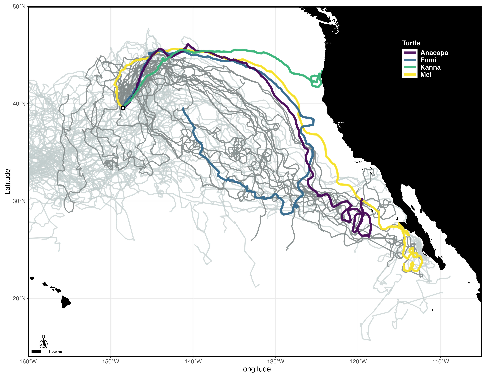{ height=600px } -->
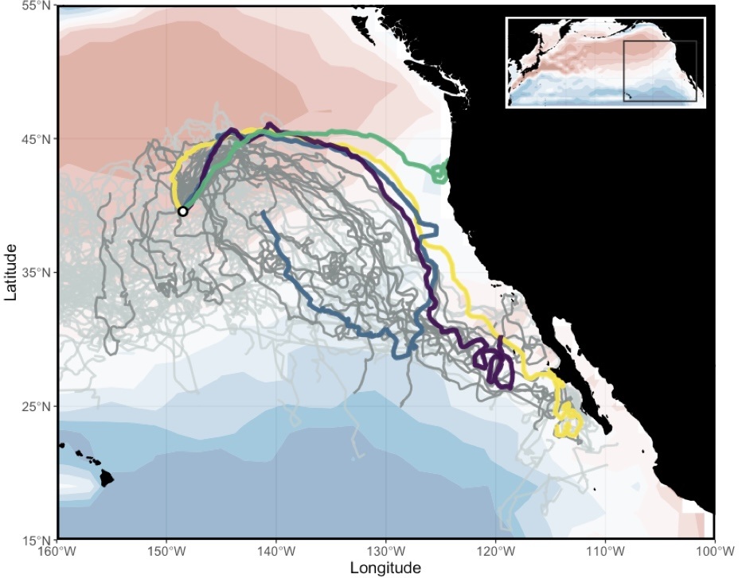{ height=600px }

 
 

### Fig 2
Mean turtle latitude during September and October, grouped by year (1997–2000, 2004–2008, 2010–2013, and 2023–2025, n=189) and averaged across the study area from 180°-*130°W* longitude. Spatial means are shown as circles. Standard error bars shown for each year-group.

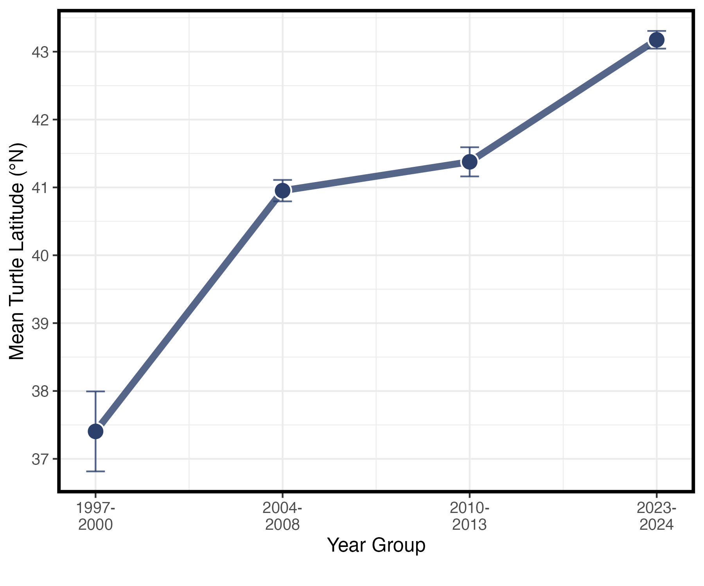{group="fig2-lats"}

 
 

### Fig 3
Monthly mean zonal currents (u, m/s) overlaid with current vectors for (A) September 2006–2007, (B) October 2006–2007, (C) September 2023, and (D) October 2023. Vector arrows represent 0.1 m/s. Full loggerhead turtle tracks are shown in grey, with the September and October segments highlighted in darker shades. The white line indicates the average monthly position of the 18°C SST isotherm. 

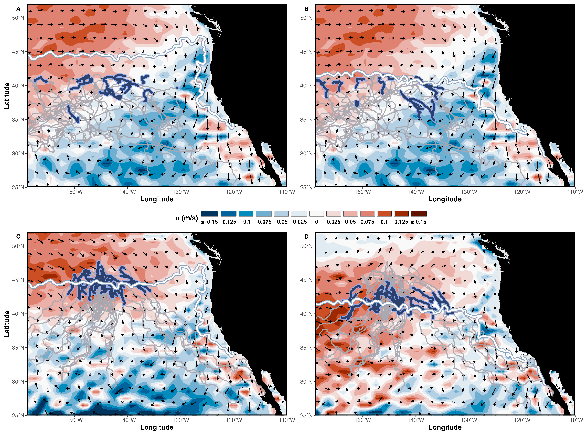

 
 

### Fig 4
Monthly mean zonal currents (u, m/s) overlaid with current vectors for (A) September 2024, (B) October 2024. Vector arrows represent 0.1 m/s. Full loggerhead turtle tracks are shown in grey, with the September and October segments highlighted in darker shades. The white line indicates the average monthly position of the 18°C SST isotherm. 

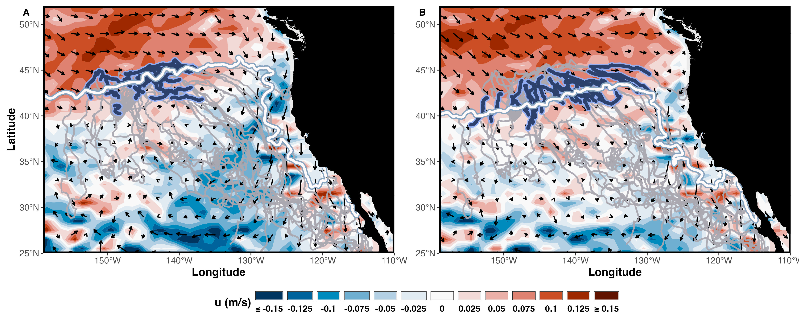

 
 

### Fig 5
Average weekly velocities of turtles (dark blue) and ocean currents (light blue) during September and October 2024 for the four individuals that entered the northern CCS: Anacapa, Fumi, Kanna, and Mei. Positive and negative values of zonal velocities (Figure 5A) indicate eastward and westward movement, respectively. Positive and negative meridional velocities (Figure 5B) indicate northward and southward movement.

<!-- ::: {layout-ncol=2} -->

A)

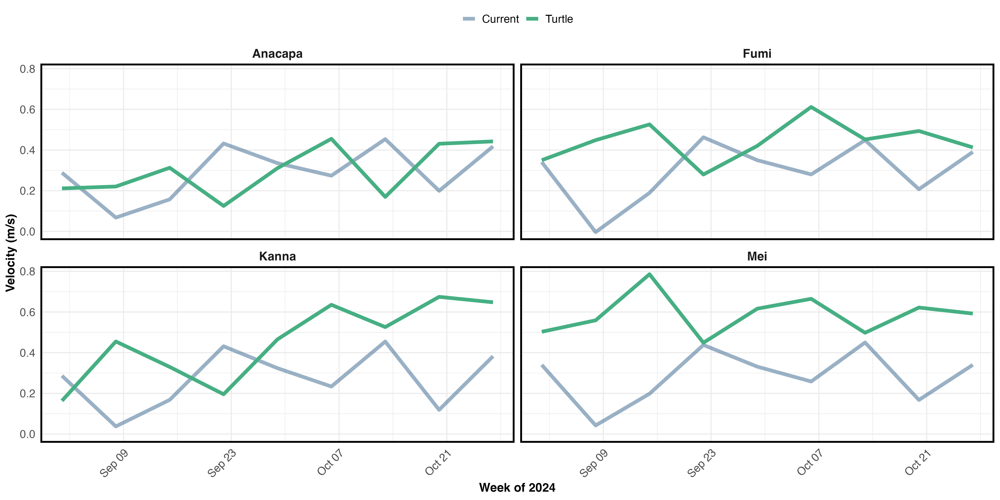{group="fig5-speeds"}

B)

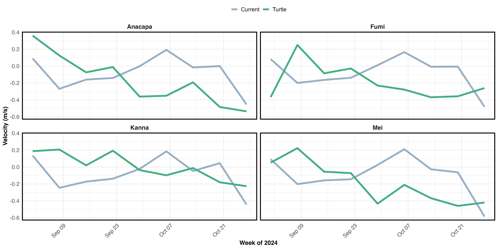{group="fig5-speeds"}
<!-- ::: -->

 
 

### Fig 6
Daily sea surface temperatures (SSTs) experienced by the four North Pacific loggerhead turtles that entered the CCS, along their migratory routes in 2024. Darker circles outlined in black indicate the positions of each individual during September and October 2024.

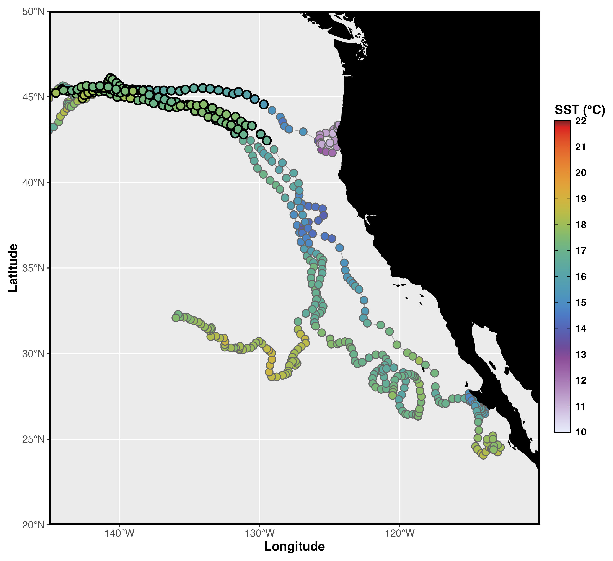

 
 

### Fig 7
Monthly mean chlorophyll‑a concentrations for (A) September, (B) October, (C) November, and (D) December 2024. Complete turtle tracks are shown in grey; portions of tracks for the four individuals that entered the CCS are highlighted in dark purple, with positions corresponding to each month.

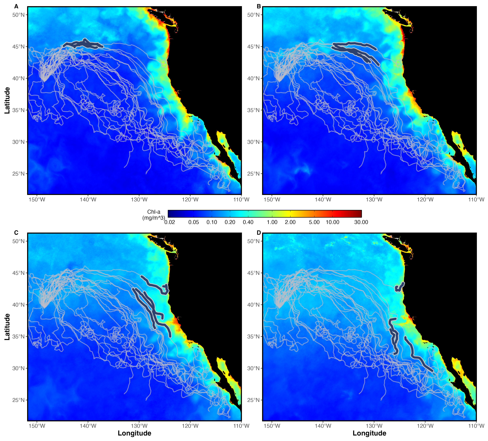

 
 

### Fig 8
Monthly mean zonal currents (u, m/s) overlaid with current vectors for (A) September 2014, (B) October 2014. Vector arrows represent 0.1 m/s. The white line indicates the average monthly position of the 18°C SST isotherm. 

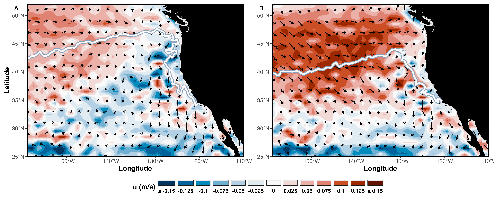  

 
 

## Supplemental Figures (in progress)

### SFig 1
Climatology of the averaged September and October monthly zonal (u, m/s) current in the eastern North Pacific Ocean over the past 20 years (2004-2024), to show the core location of the North Pacific Current (NPC, dark red). Vector arrows represent 0.1 m/s. Data source: Copernicus Marine Environmental Monitoring Service’s surface [Global Total Ekman and Geostrophic currents](https://data.marine.copernicus.eu/product/MULTIOBS_GLO_PHY_MYNRT_015_003/description), 0.25° spatial resolution, resampled to a 1° x 1° spatial grid.

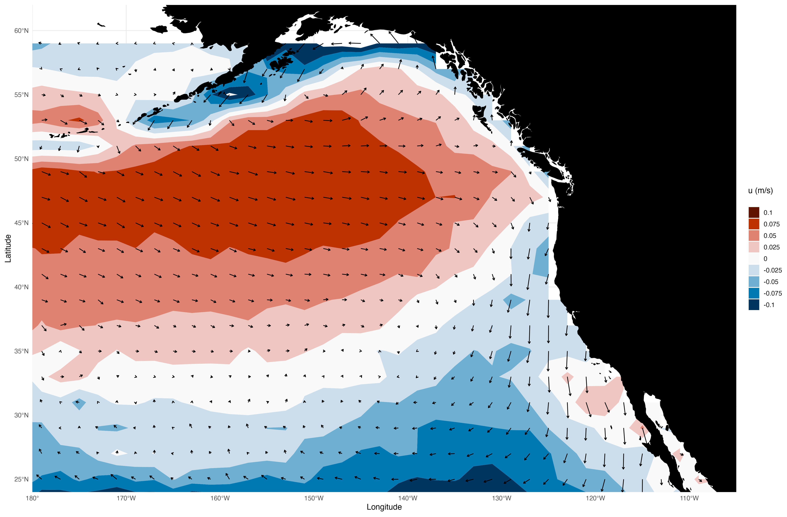{ height=600px }

 
 

### SFig 2 
Spatially-averaged (A) zonal (u) and (B) meridional (v) current strength between 42°N-46°N latitude and 150°W-130°W longitude. September and October averages are calculated for every 5° longitudinal bin.

A) Zonal (u, m/s)

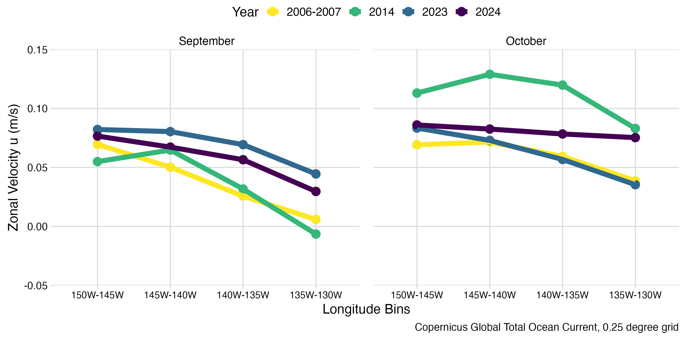{group="sfigx-lonbins"}

B) Meridional (v, m/s)

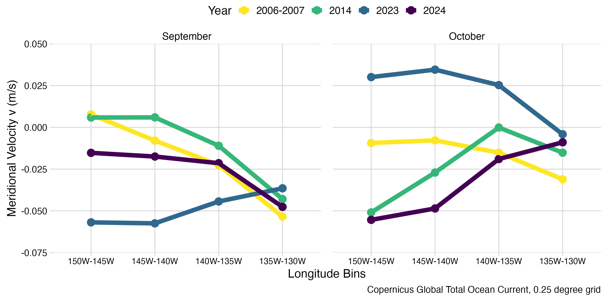{group="sfigx-lonbins"}

 
 

### SFig 3
Density plot of daily September-October SST (°C) conditions experienced by juvenile North Pacific loggerhead sea turtles by group.

 

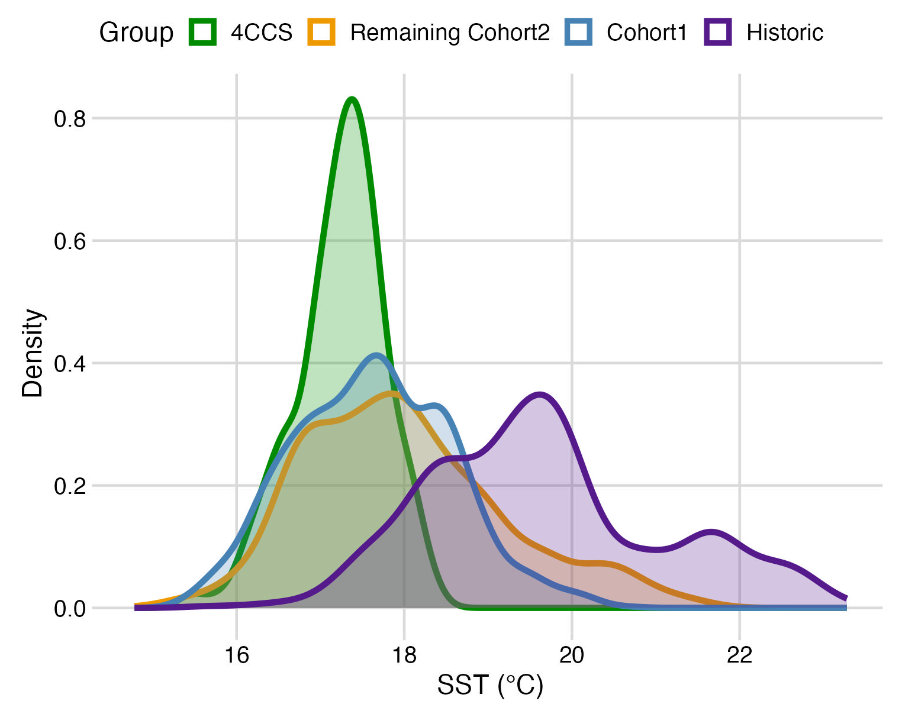{ height=400px }
 
 

### SFig 4
Density plot of daily September-October chlorophyll-a concentrations (mg/m3) experienced by juvenile North Pacific loggerhead sea turtles by group.

 

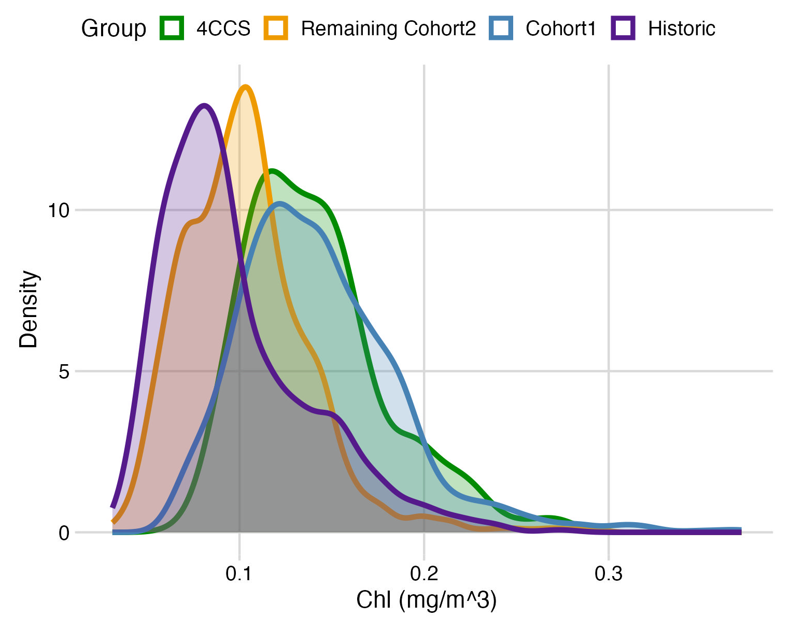{ height=400px }

 
 

### SFig 5
Density plot of daily September-October zonal current (u, m/s) experienced by juvenile North Pacific loggerhead sea turtles by group.

 

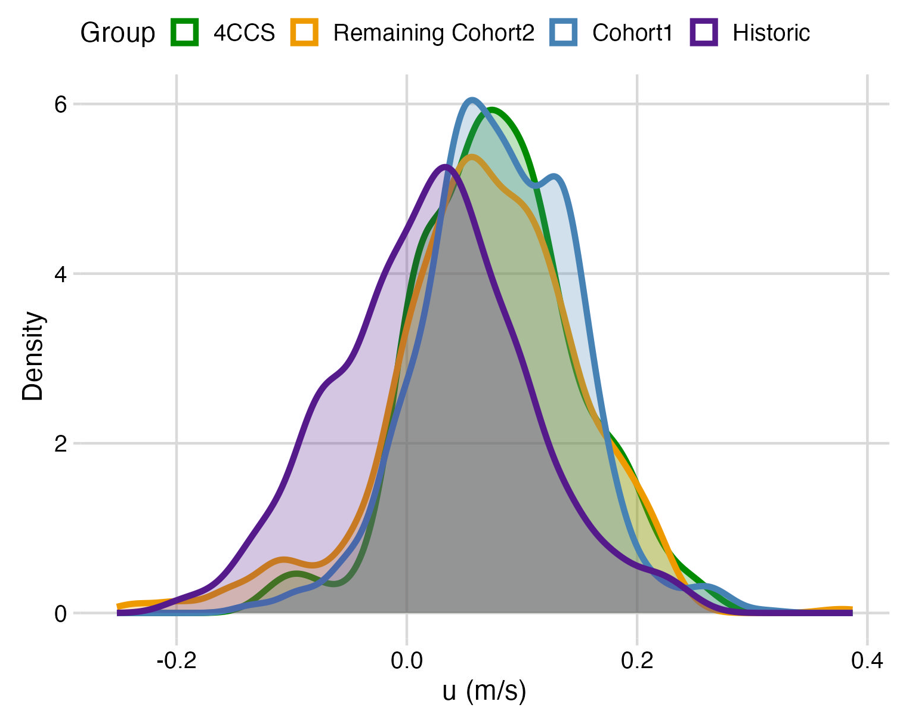{ height=400px }

 
 

### SFig6
Density plot of daily September-October meridional current (v, m/s) experienced by juvenile North Pacific loggerhead sea turtles by group.

 

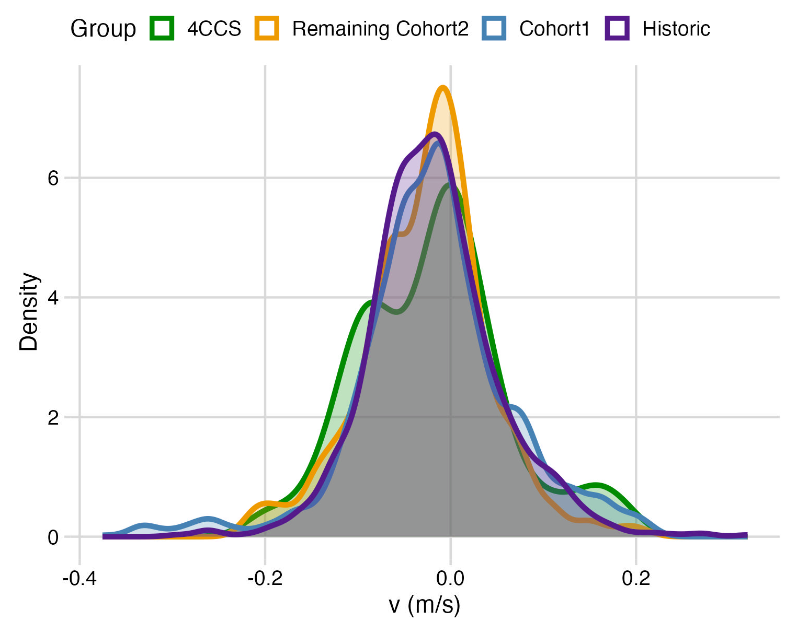{ height=400px }

 
 
