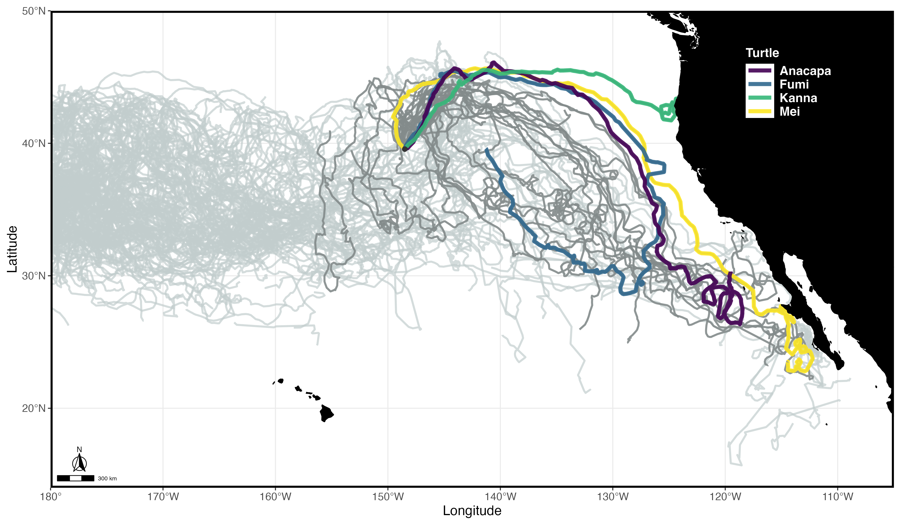
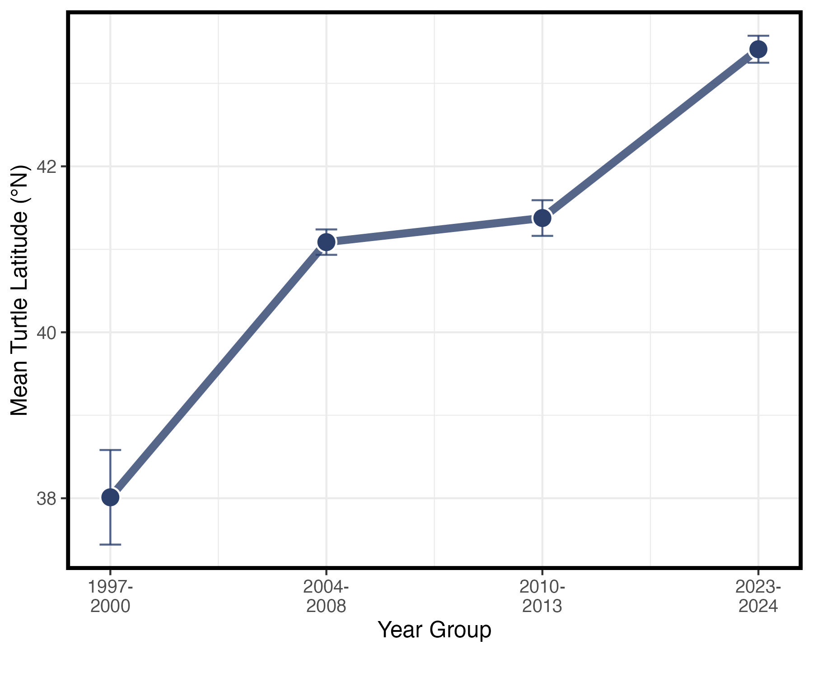

## Draft Manuscript Figures (in progress)

### Fig 1. Map of North Pacific loggerhead tracks

\

[*Placeholder Figure Below. To do: add schematic of North Pacific Current*]{style="color:#7F0000"}
Release location for Cohort 2 (July 7th, 2024) shown as black circle.

 

{ height=300px }

Historic (1997 - 2013) and STRETCH Cohort 1 (2023-2024) tracks are shown in light gray. STRETCH Cohort 2 (2024-Present) tracks are shown in darker gray. The 4 CCS turtles are color-coded by turtle name.

 
 

### Fig 2. Sept-Oct 2006-2007 (A-B) and 2023 (C-D) currents and turtle tracks

Average zonal flow (u) is shown with current vectors for (A) September 2006-2007 and (B) October 2006-2007, (C) September 2023, and (D) October 2023. The vector arrows are 0.1 m/s.

Full loggerhead tracks are shown in gray. Their September and October positions are shown as the darker segments.
The average monthly position of the 18°C SST isotherm is shown in white.

Product: Copernicus Global Total Ocean Currents (Monthly, 0.25°), processed to a 1° x 1° spatial grid.

 
 

### Fig 3. Sept/Oct 2024 (A-B) currents and turtle tracks 

Average zonal flow (u) is shown with current vectors for: (A) September 2024 and (B) October 2024.

Full loggerhead tracks are shown in gray. Their September and October positions are shown in dark purple.
The average monthly position of the 18°C SST isotherm is shown in white.

 
 

### Fig 4. Mean Sept/Oct Turtle Latitude by Year Group 

Mean turtle latitude during September and October, grouped by years. Standard error bars shown for each year-group.

 
 

### Fig 5. STRETCH turtle movement vs current velocities

::: {layout-ncol=2}

{group="fig5-speeds"}

{group="fig5-speeds"}
:::

 
 

### Fig 6. Daily Turtle-SST extractions (n=4, 2024 Cohort) 

For visualization purposes, every other day turtle positions-SST values are shown for the 4 turtles that entered the CCS. Their September and October 2024 positions are indicated by the black circle borders.

*Note: May or may not keep annotation.*

 
 

### Fig 7. Chl-a and STRETCH turtle tracks (Sept-Dec, 2024) 

Full loggerhead tracks (2024-2025) are shown in gray. Their (A) September, (B) October, (C) November, and (D) December 2024 positions are shown in dark purple.

 
 

### Fig 8. Sept/Oct 2014 currents

  

 
 

## Supplemental Figures (in progress)

### SFig 1. Sept/Oct currents (2004-2024)

{ height=600px }    
 
 